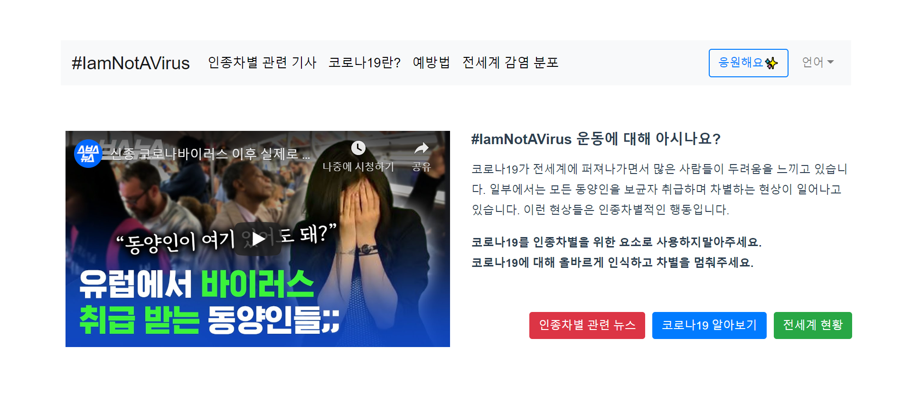
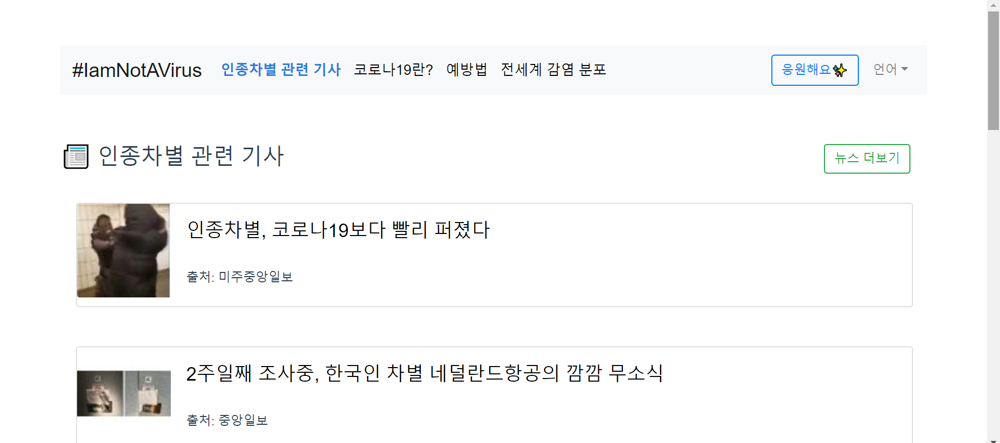
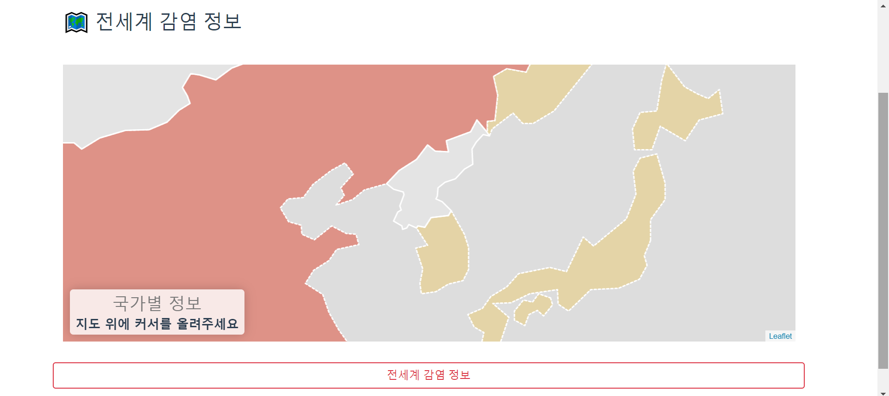
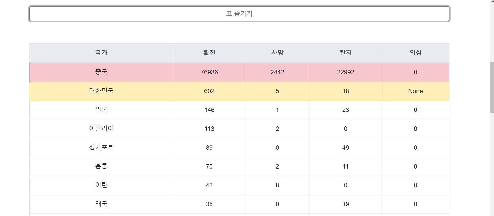

# I am Not A Virus - Web Project

Click! 👉 [www.iamnotavirus-campaign.com:8080](www.iamnotavirus-campaign.com:8080)  

    아마존 Route53이 80포트를 기본으로 하고 있어서
    일단 :8080포트를 붙여 접속해야 하는 상황입니다
    빠른 시일내에 깔끔한 주소로 접속되도록 수정할것입니다.

### 1. 구현 배경

**`#iamnotavirus`운동에 대해 아시나요?**  
신종 코로나 바이러스가 전세계에 퍼져나가면서 많은 사람들이 두려움을 느끼고 있습니다.  
그렇지만 이런 두려움과 별개로 신종 코로나 바이러스가 인종 차별의 요소로 사용되고 있습니다.  

모든 아시안들이 코로나를 보균했을거라는 생각은 인종 차별적인 생각입니다.  
신종 코로나에 대해 올바르게 인식하고 예방법을 널리 알리고자 사이트를 기획하게 되었습니다.  

### 2. 구현 내용

* 신종 코로나 설명, 예방법
* 신종 코로나에 의한 인종차별 기사 크롤링
* 전세계 확진자 분포지도
    * [코로나 바이러스 정보 제공 API 1.0](http://happycastle.club/) 활용
    
### 3. 결과 화면

#### 1) 메인 화면

#### 2) 뉴스 크롤링 페이지

#### 3)전세계 감염정보

